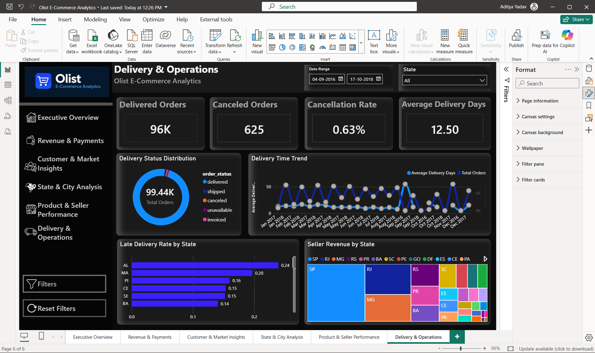
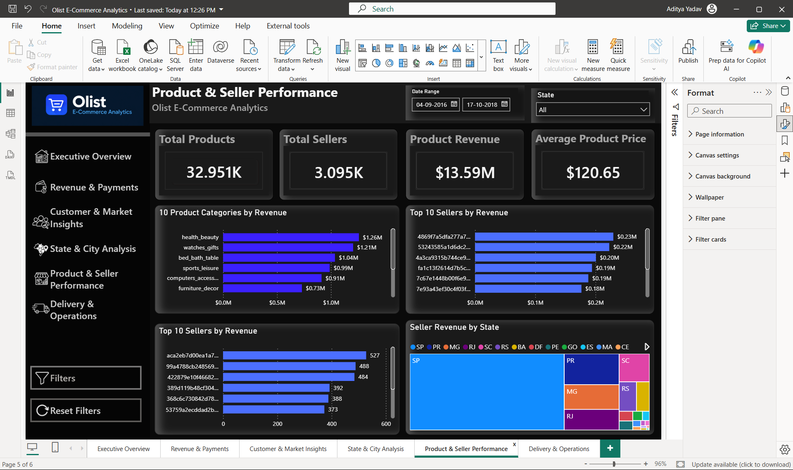
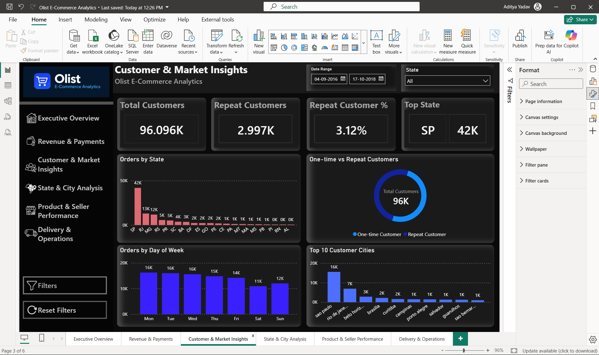

# 🛒 Olist E-Commerce Analytics | MySQL + Excel + Power BI

An end-to-end **Data Analytics and Business Intelligence project** built using the **Brazilian E-Commerce Public Dataset by Olist**.

The project covers the complete analytics workflow — from **data cleaning and SQL analysis to data modeling, DAX calculations, geographic analysis, and interactive Power BI dashboards**.

The objective is to analyze **sales performance, customers, payments, products, sellers, geographic trends, and delivery operations** to generate meaningful business insights.

---

## 📊 Dashboard Preview

The Power BI report contains **5 main analytical pages** along with a dedicated **State & City drill-through analysis**.

### 🏠 1. Executive Overview

Provides a high-level view of overall e-commerce performance.

**Key Metrics**
- Total Revenue
- Total Orders
- Average Order Value
- Average Review Score

**Visuals**
- Monthly Revenue & Orders Trend
- Orders by Status
- Top Product Categories by Revenue
- Top States by Orders



---

### 💳 2. Revenue & Payments

Analyzes revenue performance and customer payment behavior.

**Key Metrics**
- Total Revenue
- Average Order Value
- Total Transactions
- Average Installments

**Visuals**
- Monthly Revenue Trend
- Payment Method Share
- Revenue by Payment Method
- Revenue by State
- Installment Distribution



---

### 👥 3. Customer & Market Insights

Analyzes customer distribution, repeat behavior, cities, states, and purchasing patterns.

**Key Metrics**
- Total Customers
- Repeat Customers
- Repeat Customer %
- Top State

**Visuals**
- Orders by State
- Top 10 Customer Cities
- Orders by Day of Week
- Customer Type Distribution
- Geographic customer analysis



---

### 📍 State & City Analysis

A dedicated drill-through page for deeper geographic analysis.

Users can drill from a selected state into detailed customer and order information.

**Analysis Includes**
- State-level customer performance
- City-level customer distribution
- Orders by Hour
- Revenue by City
- Customer Type Distribution
- Geographic ZIP-level analysis using latitude and longitude


---

### 📦 4. Product & Seller Performance

Analyzes product categories, sales volumes, seller performance, and regional seller contribution.

**Key Metrics**
- Total Products
- Total Sellers
- Product Revenue
- Average Product Price

**Visuals**
- Top 10 Product Categories by Revenue
- Top 10 Sellers by Revenue
- Monthly Product Revenue Change
- Seller Revenue by State


---

### 🚚 5. Delivery & Operations

Focuses on fulfillment performance, delivery speed, cancellations, late orders, and freight costs.

**Key Metrics**
- Delivered Orders
- Canceled Orders
- Cancellation Rate
- Average Delivery Days

**Visuals**
- Order Status Distribution
- Average Delivery Time by Month
- Late Delivery Rate by State
- Average Freight Cost by State


---

## 🔑 Key Business Insights

The analysis highlights several important business patterns:

- 💰 **Total Revenue:** approximately **R$16.01M**
- 🛍️ **Total Orders:** **99,441**
- 👥 **Unique Customers:** **96,096**
- ⭐ **Average Review Score:** approximately **4.09 / 5**
- 📍 **São Paulo (SP)** is the largest customer market by order volume
- 💳 Multiple payment methods are used, with payment behavior analyzed by transaction value and installments
- 📦 Product-category analysis identifies the categories contributing the most revenue
- 🏪 Seller performance varies significantly across sellers and Brazilian states
- 🚚 Delivery analysis identifies differences in delivery time and late-delivery rates across regions
- 🔁 Repeat-customer behavior was analyzed separately from one-time customers
- 🗺️ ZIP-code-level latitude and longitude data were incorporated for geographic analysis

---

## 🛠️ Tech Stack

| Tool | Usage |
|---|---|
| **MySQL 8** | Database creation, relational analysis, SQL queries and views |
| **Power BI Desktop** | Data modeling, DAX, dashboards and interactive analysis |
| **Microsoft Excel** | Initial data cleaning and validation |
| **Power Query** | Data transformation and geographic data preparation |
| **DAX** | KPIs, time intelligence and analytical measures |
| **Git & GitHub** | Version control and project portfolio |

---

## 🗄️ Data Model

The Power BI model follows a relational structure connecting the major Olist entities.

### Main Tables

- `customers`
- `orders`
- `order_items`
- `order_payments`
- `order_reviews`
- `products`
- `sellers`
- `category_translation`
- `Geo_Zip`
- `Calendar`

### Core Relationships

```text
Customers
    │
    └── Orders
          │
          ├── Order Items ── Products ── Category Translation
          │        │
          │        └── Sellers
          │
          ├── Order Payments
          │
          └── Order Reviews

Calendar ── Orders

Geo_Zip ── Customers
```

The geographic table was aggregated to the **ZIP-code-prefix level** before being connected to the customer table.

---

## ⚙️ Project Workflow

```text
1. Download Olist Brazilian E-Commerce dataset from Kaggle
                 ↓
2. Inspect and validate all source CSV files
                 ↓
3. Clean and transform data using Excel / Power Query
                 ↓
4. Create MySQL database and relational tables
                 ↓
5. Import cleaned Olist datasets into MySQL
                 ↓
6. Validate row counts, nulls and relationships
                 ↓
7. Perform SQL-based business analysis
                 ↓
8. Create reusable SQL views
                 ↓
9. Connect MySQL database to Power BI Desktop
                 ↓
10. Build relational Power BI data model
                 ↓
11. Create Calendar table and DAX measures
                 ↓
12. Add geographic ZIP-level latitude / longitude analysis
                 ↓
13. Build 5 main interactive dashboard pages
                 ↓
14. Add State & City drill-through analysis
                 ↓
15. Add slicers, page navigation and reset controls
                 ↓
16. Validate KPIs and finalize dashboard design
```

---

## 🧮 Key DAX Measures

### Total Orders

```DAX
Total Orders =
DISTINCTCOUNT('olist_ecommerce orders'[order_id])
```

### Total Revenue

```DAX
Total Revenue =
SUM('olist_ecommerce order_payments'[payment_value])
```

### Average Order Value

```DAX
Average Order Value =
DIVIDE(
    [Total Revenue],
    [Total Orders]
)
```

### Total Customers

```DAX
Total Customers =
DISTINCTCOUNT(
    'olist_ecommerce customers'[customer_unique_id]
)
```

### Average Review Score

```DAX
Average Review Score =
AVERAGE(
    'olist_ecommerce order_reviews'[review_score]
)
```

### Delivered Orders

```DAX
Delivered Orders =
CALCULATE(
    [Total Orders],
    'olist_ecommerce orders'[order_status] = "delivered"
)
```

### Canceled Orders

```DAX
Canceled Orders =
CALCULATE(
    [Total Orders],
    'olist_ecommerce orders'[order_status] = "canceled"
)
```

### Cancellation Rate

```DAX
Cancellation Rate =
DIVIDE(
    [Canceled Orders],
    [Total Orders]
)
```

### Product Revenue

```DAX
Product Revenue =
SUM(
    'olist_ecommerce order_items'[price]
)
```

### Total Products

```DAX
Total Products =
DISTINCTCOUNT(
    'olist_ecommerce products'[product_id]
)
```

### Total Sellers

```DAX
Total Sellers =
DISTINCTCOUNT(
    'olist_ecommerce sellers'[seller_id]
)
```

---

## 🧾 SQL Analysis

The project includes **25 business-focused SQL queries** covering:

- Overall KPIs
- Monthly order trends
- Revenue analysis
- Average order value
- Payment-method analysis
- Product-category performance
- Customer-state performance
- Repeat customers
- Order status
- Review-score distribution
- Seller performance
- Delivery performance
- Freight analysis
- Late-delivery analysis
- Cancellation analysis
- Customer-city performance

SQL file:

```text
sql/Olist_Ecommerce_SQL_Analysis.sql
```

---

## 👁️ SQL Views

Four reusable MySQL views were created:

```text
vw_order_summary
vw_product_sales
vw_customer_orders
vw_delivery_analysis
```

These views simplify repeated analytical queries and provide reusable business-level datasets.

---

## 🌎 Geolocation Analysis

The original Olist geolocation dataset contains a very large number of location records.

For efficient Power BI analysis, the geolocation data was transformed to ZIP-code-prefix level.

The final geographic table contains:

```text
geolocation_zip_code_prefix
Avg Latitude
Avg Longitude
```

The geographic table is connected to customer ZIP codes and supports state/city/location analysis in Power BI.

---

## 🎛️ Dashboard Interactivity

The Power BI report includes:

- 📅 Date Range slicer
- 📍 State slicer
- 🔍 Filter controls
- 🔄 Reset Filters
- 🧭 Page navigation sidebar
- 🗺️ State-level drill-through
- 📌 State & City Analysis
- 🕒 Last Refresh indicator
- 📊 Cross-filtering between visuals
- 🎯 Top-N filtering
- 📈 Time-based trend analysis

---

## 🎨 Dashboard Design

The report uses a custom dark premium theme.

| Element | Color |
|---|---|
| Canvas | `#0A0A0A` |
| Sidebar | `#050505` |
| Header | `#0C0C0C` |
| Cards | `#1A1A1A` |
| Border | `#343434` |
| Primary Accent | `#3B20FF` |
| Secondary Accent | `#4C6FFF` |
| Positive | `#34D399` |
| Negative | `#FF5C5C` |
| Main Text | `#F5F5F5` |
| Muted Text | `#A3A3A3` |

---

## 📁 Repository Structure

```text
Olist_Ecommerce_Analytics/
│
├── README.md
├── .gitignore
│
├── excel/
│   └── Olist_Ecommerce_Analysis.xlsx
│
├── sql/
│   └── Olist_Ecommerce_SQL_Analysis.sql
│
├── powerbi/
│   └── Olist_Ecommerce_Analytics.pbix
│
├── screenshots/
│   ├── 01_Executive_Overview.png
│   ├── 02_Revenue_Payments.png
│   ├── 03_Customer_Market.png
│   ├── 04_State_City_Analysis.png
│   ├── 05_Product_Seller.png
│   └── 06_Delivery_Operations.png
│
└── data/
    └── raw/
        └── Raw dataset excluded from GitHub
```

---

## 📦 Dataset

This project uses the **Brazilian E-Commerce Public Dataset by Olist**.

The dataset contains approximately **100,000 e-commerce orders** and includes information about customers, sellers, products, payments, reviews, orders, and geographic locations.

**Dataset Source:**  
[Kaggle – Brazilian E-Commerce Public Dataset by Olist](https://www.kaggle.com/datasets/olistbr/brazilian-ecommerce)

> Raw CSV files are not included in this repository due to file size.

### Dataset Tables

| Dataset | Description |
|---|---|
| Customers | Customer IDs, ZIP codes, cities and states |
| Orders | Order status and purchase/delivery timestamps |
| Order Items | Products, sellers, prices and freight |
| Order Payments | Payment methods, installments and values |
| Order Reviews | Review scores and customer feedback |
| Products | Product categories and dimensions |
| Sellers | Seller ZIP codes and locations |
| Geolocation | ZIP codes with latitude and longitude |
| Category Translation | Portuguese-to-English category mapping |

> Raw CSV files are intentionally excluded from this repository because of file size.

**Dataset Source:** Kaggle — Brazilian E-Commerce Public Dataset by Olist

---

## 🚀 How to Use the Project

1. Clone or download this repository.
2. Open the SQL script in **MySQL Workbench** to review the analysis.
3. Open the Excel workbook to inspect the cleaned analytical data.
4. Open:

```text
powerbi/Olist_Ecommerce_Analytics.pbix
```

in **Power BI Desktop**.

5. Explore the dashboard using:
   - Date filters
   - State filters
   - Page navigation
   - Drill-through
   - Reset filters

> A local MySQL connection may be required if the Power BI report is refreshed from the original database source.

---

## 🎯 Project Objective

The purpose of this project is to demonstrate an end-to-end Data Analytics workflow involving:

- Data cleaning
- Relational database design
- SQL analysis
- Data modeling
- Business KPI development
- DAX
- Power Query
- Geographic analytics
- Dashboard development
- Business storytelling
- Interactive Power BI reporting

---

## 📌 Future Improvements

Potential extensions include:

- Customer segmentation
- Customer lifetime value analysis
- Sales forecasting
- Delivery-delay prediction
- Product recommendation analysis
- Advanced geographic heatmaps
- Automated Power BI Service refresh

---

## 👤 Author

**Aditya Yadav**

Data Analytics | Power BI | SQL | Excel

- **GitHub:** https://github.com/ydvadityaa
<!-- - **LinkedIn:** [Add your LinkedIn profile URL] -->

---

## ⭐ Support

If you found this project useful or interesting, consider giving the repository a **⭐ Star**.

Feedback and suggestions are always welcome.
